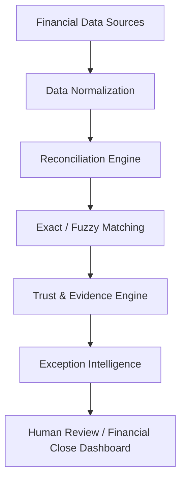

# ReconGuard AI

## Explainable Financial Reconciliation & Exception Investigation

ReconGuard AI is a Streamlit-based financial operations workspace that reconciles payment gateway, bank, and internal ledger records. It combines deterministic matching with trust scoring, evidence trails, exception intelligence, human-review routing, and financial-close reporting.

## Problem

Finance teams reconcile the same transaction across systems that use different identifiers, settlement dates, references, fees, and posting conventions. Exact comparisons miss legitimate matches, while broad automation can silently approve duplicates or amount discrepancies. Manual review is slow, inconsistent, and difficult to audit.

## Solution

ReconGuard AI normalizes the three source exports, ranks exact and fuzzy candidates, calculates a weighted match score, and applies configurable decision thresholds. Every decision receives an independent trust score, structured evidence, an exception classification, a priority, and a recommended action. Uncertain cases remain in the human-review queue instead of being silently resolved.

## Key Features

- Multi-source bank, gateway, and ledger reconciliation
- Exact and RapidFuzz-assisted fuzzy transaction matching
- Explainable trust score with a visible breakdown
- Human-review routing for uncertain decisions
- Deterministic amount, date, duplicate, fee, and missing-record classification
- Numerical and categorical priority scoring
- Source-level evidence trail for every result
- AI-style investigation summary generated from actual evidence
- Financial close intelligence and estimated exposure
- Interactive Streamlit dashboard with upload workflow
- Reproducible synthetic demo dataset with ground-truth labels
- Accuracy, precision, recall, F1, and operational evaluation metrics

## Architecture



## Technology Stack

- Python 3.11+
- Streamlit for the application interface
- Pandas and NumPy for tabular processing and synthetic data
- RapidFuzz for fuzzy field similarity
- scikit-learn for synthetic evaluation metrics
- Faker for reproducible realistic demo records
- Pytest for automated tests

## Screenshots

Screenshots can be added here for the following views:

- Dashboard
- Data Workspace
- Reconciliation Results
- Investigation View
- Financial Close Intelligence

No screenshot files are currently included in the repository.

## Installation

```bash
git clone <repository-url>
cd ReconGuard-AI
python -m venv .venv
```

On Windows PowerShell:

```powershell
.venv\Scripts\Activate.ps1
```

Install dependencies and launch the application:

```bash
pip install -r requirements.txt
python -m streamlit run app.py
```

## Running with Demo Data

Open the local Streamlit URL and use **Data Workspace** in the sidebar. Choose **Load demo dataset** to load 150 reproducible transactions across bank, gateway, and ledger sources. The generated ground-truth labels are used only for the synthetic evaluation panel.

To write CSV fixtures locally:

```bash
python -c "from src.data.synthetic_generator import generate_demo_data; generate_demo_data(150, 42, 'data/generated')"
```

Generated CSVs under `data/generated/` are intentionally ignored because the application can recreate them deterministically.

## Reconciliation Methodology

Uploaded source columns are normalized from common aliases such as `txn_id`, `value`, `settlement_date`, and `merchant_name`. Gateway records provide the anchor transaction list. Bank and ledger rows are ranked using transaction ID, amount, date, merchant, and reference similarities.

The weighted score is:

`0.35 x transaction ID + 0.25 x amount + 0.15 x date + 0.15 x merchant + 0.10 x reference`

Scores from 85 to 100 are eligible for automatic matching only when all available sources agree on amount. Scores from 60 to 84 route to human review. Lower scores remain exceptions.

## Trust Score

Trust is separate from the match score. It starts with base match confidence, adds cross-source agreement and completeness bonuses, and subtracts ambiguity and duplicate-candidate penalties. The final value is clamped to 0–100 and shown with its component breakdown. Low-confidence or materially inconsistent cases are not silently approved.

## Evaluation

The synthetic generator keeps ground-truth scenario labels separate from production-style source records. For demo data, predicted automatic matches are compared with the `EXACT_MATCH` label and the app calculates accuracy, precision, recall, and F1. Uploaded real-world files have no ground truth, so the app does not fabricate evaluation scores for them.

## Project Structure

```text
ReconGuard-AI/
├── app.py
├── requirements.txt
├── .env.example
├── .gitignore
├── LICENSE
├── data/
│   ├── generated/
│   └── sample/
├── docs/
│   ├── architecture.md
│   └── methodology.md
├── src/
│   ├── analytics/
│   ├── data/
│   ├── intelligence/
│   ├── reconciliation/
│   └── utils/
└── tests/
```

## Limitations

- Synthetic data does not represent every banking or ERP export format.
- Fuzzy matching rules require tuning for a specific institution and merchant population.
- Partial settlements, refunds, and fees are surfaced as evidence-based recommendations, not asserted facts.
- AI-style explanations are advisory and should not replace human financial review.
- The current application uses local CSVs and does not persist investigation history.

## Future Improvements

- Real-time reconciliation and ERP/payment-provider integrations
- OCR for financial documents and settlement reports
- More advanced anomaly detection and merchant-specific rules
- Multi-user workflows, approvals, and audit logs
- Persistent investigation history and report export

## License

This project is available under the [MIT License](LICENSE).
