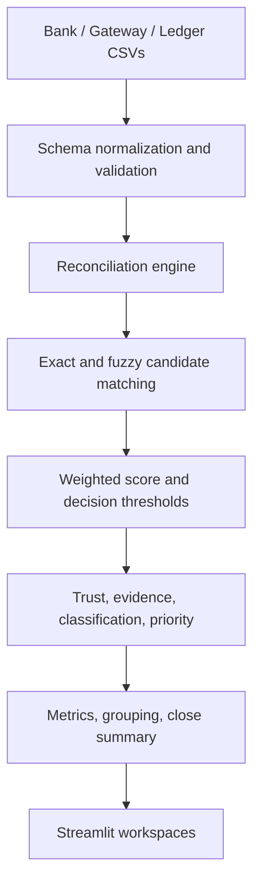

# ReconGuard AI Architecture

The gateway is the anchor source. Each gateway record is compared to the best bank and ledger candidates. The engine returns a stable result object containing source records, per-field similarities, candidate count, status, and match score. Intelligence functions enrich that object without mutating the matching decision. This boundary makes explanations auditable and testable.

The application stores no credentials and uses local CSVs. The synthetic generator provides the demo path and a separate ground-truth table for evaluation. `app.py` owns presentation and session state; `src/` owns the reusable data, reconciliation, intelligence, and analytics modules.
